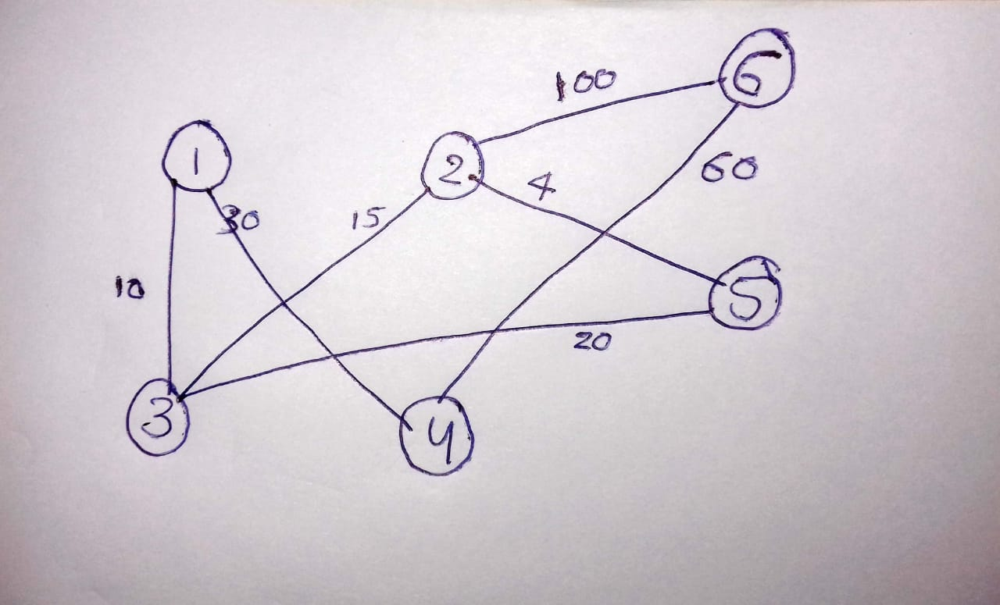
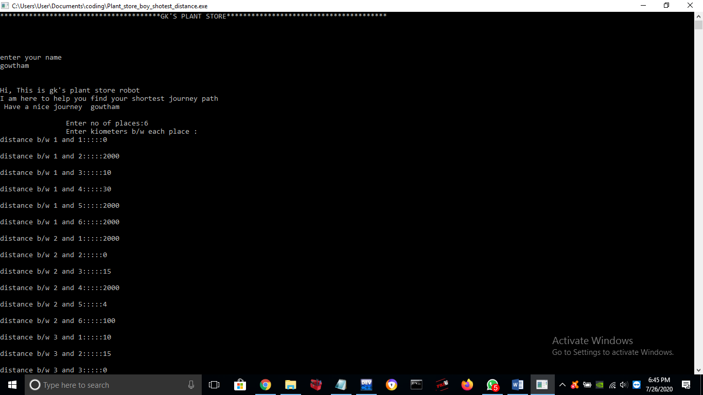
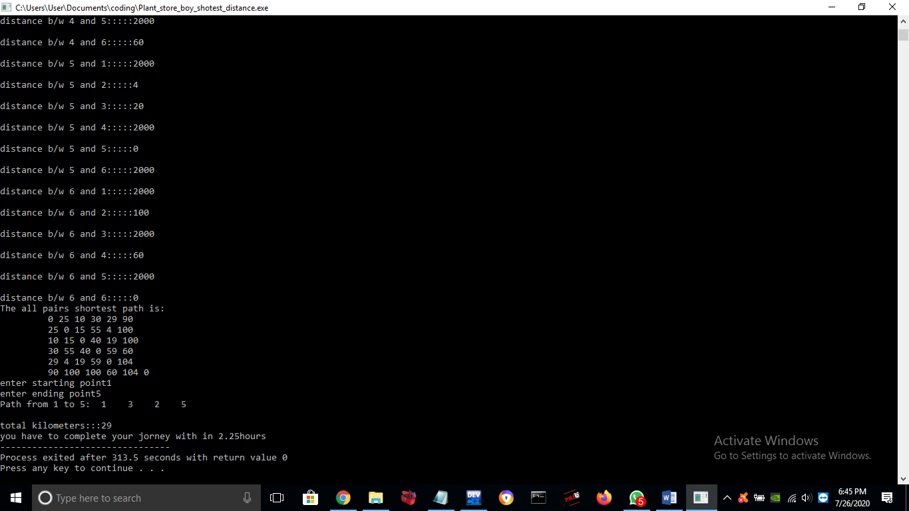

# Plant_Store_Boy_Shotest_Distance
project that helps delivery boys to find best path to reach destination and this project also gives distance and estimated time

### important points 
- While giving values if path exist and no direct path then give 2000 as value or any bigger number,example ....

 >City graph

#### input & output to code
 

here from 1st place to 1st place distance is zero but 1st place to 6 or 2 or 5 it has indirect path but we dont know the distance then give 2000 or any bigger number as input, same like this give 2000 as input if it has no direct path and has indirect path for remaining.   
